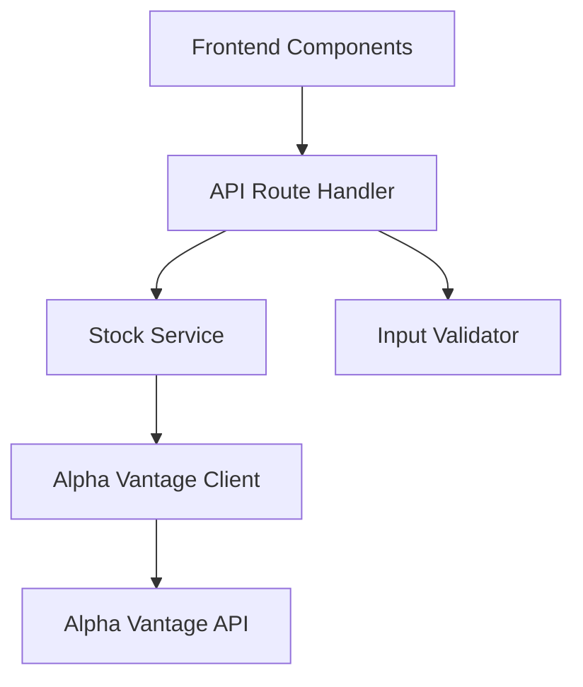

# Design Document

## Overview

This feature implements a simple backend API service layer for fetching real-time stock market data from Alpha Vantage. The API follows Next.js App Router patterns with route handlers, providing RESTful endpoints for the frontend to consume stock quotes without exposing external API keys to the client.

## Steering Document Alignment

### Technical Standards (tech.md)

- Uses Next.js 15 App Router with TypeScript for type safety
- Implements server-side API routes within the same repository
- Follows existing error handling patterns with standardized JSON responses
- Leverages environment variables for secure API key management
- Simple, maintainable implementation without premature optimization

### Project Structure (structure.md)

- API routes in `src/app/api/stocks/` following App Router conventions
- Service layer in `src/lib/services/` for Alpha Vantage integration
- Types extended in `src/lib/types/` for API responses
- Follows kebab-case naming for files and camelCase for functions

## Code Reuse Analysis

### Existing Components to Leverage

- **Stock type interface**: Extend existing `Stock` interface from `@/lib/types` for consistency
- **NextResponse patterns**: Follow established patterns from `api/watchlist/route.ts`
- **Error response format**: Use consistent error structure with success/error/data pattern
- **Validation utilities**: Leverage `isValidTicker` and `normalizeTicker` from `@/lib/validation/ticker`

### Integration Points

- **Frontend components**: Existing dashboard will consume the new API endpoints
- **Type system**: New API response types will extend current Stock interface
- **Error handling**: Integrate with existing error display patterns in UI

## Architecture

The API follows a simple, straightforward architecture:



### Modular Design Principles

- **Single File Responsibility**: Each file handles one specific concern (routing, service logic, API client)
- **Component Isolation**: Alpha Vantage client isolated from route handlers through service layer
- **Service Layer Separation**: Business logic separated from HTTP handling and external API calls
- **Utility Modularity**: Separate utilities for data transformation

## Components and Interfaces

### API Route Handler (`src/app/api/stocks/quote/[symbol]/route.ts`)

- **Purpose:** Handle HTTP requests for stock quotes and validate input
- **Interfaces:**
  - `GET /api/stocks/quote/[symbol]` - Single stock quote
- **Dependencies:** Stock service, input validator
- **Reuses:** NextResponse patterns, existing validation utilities

### Stock Service (`src/lib/services/stock-service.ts`)

- **Purpose:** Orchestrate data fetching and transformation
- **Interfaces:**
  - `getQuote(symbol: string): Promise<StockQuote>`
- **Dependencies:** Alpha Vantage client
- **Reuses:** Existing Stock type interface

### Alpha Vantage Client (`src/lib/services/alpha-vantage-client.ts`)

- **Purpose:** Handle direct API communication with Alpha Vantage
- **Interfaces:**
  - `fetchQuote(symbol: string): Promise<AlphaVantageResponse>`
- **Dependencies:** Environment variables for API key
- **Reuses:** None (new component)

## Data Models

### StockQuote (extends Stock)

```typescript
interface StockQuote extends Stock {
  symbol: string;
  name: string;
  price: number;
  change: number;
  changePercent: number;
  volume: number;
  timestamp: string;
}
```

### AlphaVantageResponse

```typescript
interface AlphaVantageResponse {
  'Global Quote': {
    '01. symbol': string;
    '02. open': string;
    '03. high': string;
    '04. low': string;
    '05. price': string;
    '06. volume': string;
    '07. latest trading day': string;
    '08. previous close': string;
    '09. change': string;
    '10. change percent': string;
  };
}
```

### APIResponse

```typescript
interface APIResponse<T> {
  success: boolean;
  data?: T;
  error?: {
    message: string;
    code?: string;
  };
}
```

## Error Handling

### Error Scenarios

1. **Invalid Stock Symbol**

   - **Handling:** Return 400 with clear error message
   - **User Impact:** "Invalid ticker symbol: XYZ" displayed in UI

2. **Alpha Vantage API Error**

   - **Handling:** Return appropriate status code with error message
   - **User Impact:** Display API error message to user

3. **Missing API Key**

   - **Handling:** Return 500, log critical error
   - **User Impact:** "Service configuration error. Contact support."

4. **Network Error**

   - **Handling:** Return 503 Service Unavailable
   - **User Impact:** "Unable to fetch stock data. Please try again."

5. **Invalid Response Format**
   - **Handling:** Return 502 Bad Gateway
   - **User Impact:** "Invalid data received from market provider."

## Testing Strategy

### Unit Testing

- Test Alpha Vantage response parsing and transformation
- Test input validation for various symbol formats
- Test error response formatting

### Integration Testing

- Test full flow from API route to mocked Alpha Vantage response
- Test error propagation through layers
- Test various error scenarios

### End-to-End Testing

- Test fetching real stock data (with test API key)
- Test error scenarios with invalid symbols
- Test network error handling
