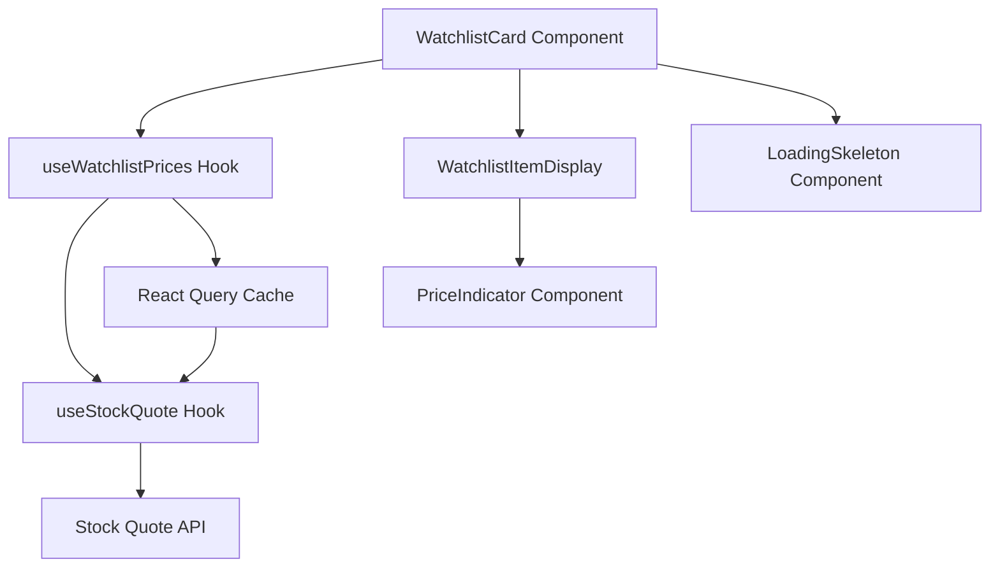

# Design Document

## Overview

This feature enhances the WatchlistCard component to display live stock price data by integrating with the existing stock quote API infrastructure. The design leverages the established useStockQuote hook and stock service patterns while introducing efficient batch fetching capabilities for multiple watchlist items. The implementation will maintain component modularity, utilize React Query for caching, and provide graceful error handling with visual price indicators.

## Steering Document Alignment

### Technical Standards (tech.md)

- **React 19 & Next.js 15**: Utilizes Server Components where possible, with client-side interactivity for real-time updates
- **TypeScript Strict Mode**: All new interfaces and types follow strict typing patterns
- **TanStack Query**: Leverages existing React Query setup for server state management and caching
- **Tailwind CSS**: Uses utility classes for styling price indicators and loading states
- **Performance Target**: Meets <3s initial load requirement through parallel fetching

### Project Structure (structure.md)

- **Feature Module Organization**: Code remains within `/features/stock-dashboard/` maintaining feature cohesion
- **Component Separation**: WatchlistCard UI separated from data fetching logic
- **Hook Pattern**: New `useWatchlistPrices` hook follows existing `use-kebab-case.ts` naming
- **Type Definitions**: Extended types in `/types/stocks.ts` for watchlist items with price data
- **Single Responsibility**: Each new file handles one specific concern (fetching, display, or formatting)

## Code Reuse Analysis

### Existing Components to Leverage

- **useStockQuote Hook**: Extended for batch operations with multiple symbols
- **Stock Service**: Existing `/api/stocks/quote/[symbol]` endpoint used without modification
- **APIResponse Type**: Reused for consistent error handling patterns
- **Validation Utilities**: `validateTicker` and `normalizeTicker` from `/lib/validation/ticker`
- **UI Components**: Card, Button, Input from shadcn/ui component library

### Integration Points

- **Watchlist API**: Existing `/api/watchlist` endpoint provides symbol list
- **React Query Cache**: Shares cache with other stock data components for efficiency
- **Error Boundaries**: Integrates with app-level error handling
- **Theme System**: Respects light/dark mode for price indicators

## Architecture

The architecture follows a layered approach with clear separation of concerns:



### Modular Design Principles

- **Single File Responsibility**: Each component handles one aspect (display, fetching, or formatting)
- **Component Isolation**: Price display logic isolated in dedicated PriceIndicator component
- **Service Layer Separation**: Data fetching abstracted into hooks, keeping components pure
- **Utility Modularity**: Price formatting utilities separated from display components

## Components and Interfaces

### Enhanced WatchlistCard Component

- **Purpose:** Container component that orchestrates watchlist display with live prices
- **Interfaces:** No external API, consumes props from parent layout
- **Dependencies:** useWatchlistPrices hook, WatchlistItemDisplay, LoadingSkeleton
- **Reuses:** Existing Card UI components, validation utilities

### WatchlistItemDisplay Component

- **Purpose:** Displays individual watchlist item with symbol and price data
- **Interfaces:** Props: `{ symbol: string, priceData?: StockQuote, loading: boolean }`
- **Dependencies:** PriceIndicator component for price visualization
- **Reuses:** Button component for remove action

### PriceIndicator Component

- **Purpose:** Renders price with color-coded change indicators
- **Interfaces:** Props: `{ price: number, change: number, changePercent: number }`
- **Dependencies:** Tailwind utilities for styling
- **Reuses:** Common number formatting utilities

### useWatchlistPrices Hook

- **Purpose:** Manages fetching and caching of multiple stock quotes
- **Interfaces:** Returns: `{ data: Map<string, StockQuote>, loading: boolean, error: Error | null }`
- **Dependencies:** useStockQuote, React Query
- **Reuses:** Existing stock quote fetching infrastructure

### LoadingSkeleton Component

- **Purpose:** Displays skeleton loaders during initial data fetch
- **Interfaces:** Props: `{ count: number }`
- **Dependencies:** Tailwind animation utilities
- **Reuses:** Common skeleton patterns from UI library

## Data Models

### Extended WatchlistItem Type

```typescript
interface WatchlistItemWithPrice extends WatchlistItem {
  priceData?: {
    price: number;
    change: number;
    changePercent: number;
    volume: number;
    lastUpdated: string;
  };
  loading: boolean;
  error?: string;
}
```

### Watchlist Prices Map

```typescript
type WatchlistPricesMap = Map<
  string,
  {
    quote: StockQuote | null;
    loading: boolean;
    error: Error | null;
    lastFetch: number;
  }
>;
```

### Price Display Config

```typescript
interface PriceDisplayConfig {
  showVolume: boolean;
  showPercentage: boolean;
  colorScheme: 'default' | 'colorblind';
  precision: number;
}
```

## Error Handling

### Error Scenarios

1. **Individual Symbol Fetch Failure**

   - **Handling:** Display symbol with "Price unavailable" message, continue showing other symbols
   - **User Impact:** Partial data display with clear indication of failed items

2. **API Rate Limit Exceeded**

   - **Handling:** Use cached data with stale indicator, implement exponential backoff
   - **User Impact:** Shows last known prices with timestamp and refresh option

3. **Network Connectivity Loss**

   - **Handling:** Show offline banner, use cached data where available
   - **User Impact:** Clear offline indication with cached data display

4. **Invalid Symbol in Watchlist**

   - **Handling:** Mark as invalid with option to remove, skip in batch requests
   - **User Impact:** Visual indicator of invalid symbol with removal suggestion

5. **Complete API Service Failure**
   - **Handling:** Display error message with retry button, preserve watchlist functionality
   - **User Impact:** Can still manage watchlist items, prices shown as unavailable

## Testing Strategy

### Unit Testing

- Test PriceIndicator component with various price change scenarios
- Test useWatchlistPrices hook with mock API responses
- Test error handling for each error scenario
- Verify proper cleanup on component unmount

### Integration Testing

- Test full flow from adding symbol to displaying live price
- Test cache behavior with multiple components using same symbols
- Test graceful degradation with API failures
- Verify proper rate limit handling

### End-to-End Testing

- User adds new symbol and sees price within 3 seconds
- User with 20+ symbols sees all prices load efficiently
- User experiences network interruption and sees cached data
- User removes symbol and sees immediate UI update
